# 图1-1 系统功能模块图

系统名称：基于微信小程序的家庭膳食管理与菜谱推荐系统

## Final Node List

### 第1层：系统名称

- 基于微信小程序的家庭膳食管理与菜谱推荐系统

### 第2层：一级功能模块

1. 身份与家庭管理
2. 菜谱与食材管理
3. 菜单管理
4. 饮食限制与偏好管理
5. 菜谱推荐管理
6. 用餐反馈与统计

### 第3层：具体功能

#### 1. 身份与家庭管理

- 全局强制登录与会话恢复
- 用户名和头像管理
- 创建家庭
- 邀请码加入家庭
- 家庭名称修改
- 邀请码读取、复制和管理员刷新
- 家庭成员与权限管理
- 创建者身份移交和退出家庭

#### 2. 菜谱与食材管理

- 菜谱查询
- 菜谱新增
- 菜谱编辑
- 菜谱软删除
- 食材明细管理
- 菜谱封面管理

#### 3. 菜单管理

- 日期与餐次选择
- 添加菜谱
- 删除菜单项
- 菜单备注
- 历史菜单查看

#### 4. 饮食限制与偏好管理

- 成员饮食限制
- 成员口味偏好
- 家庭限制与偏好汇总

#### 5. 菜谱推荐管理

- 推荐条件设置
- 饮食限制过滤
- 偏好与多因素评分
- 推荐结果与推荐理由
- 推荐结果应用到菜单

#### 6. 用餐反馈与统计

- 星级评分
- 文字评价
- 菜单数量统计
- 菜单项数量统计
- 平均评分统计
- 热门菜谱统计

## Mermaid Flowchart Source

```mermaid
flowchart TB
%%{init: {"flowchart": {"curve": "linear"}}}%%
    system["基于微信小程序的家庭膳食管理与菜谱推荐系统"]

    subgraph familyGroup["身份与家庭管理"]
        familyModule["身份与家庭管理"]
        familyLogin["全局强制登录"]
        familyProfile["用户名和头像"]
        familyCreate["创建家庭"]
        familyJoin["邀请码加入家庭"]
        familyAdmin["家庭改名与邀请码刷新"]
        familyMembers["成员权限与创建者移交"]
        familyModule --> familyLogin
        familyModule --> familyProfile
        familyModule --> familyCreate
        familyModule --> familyJoin
        familyModule --> familyAdmin
        familyModule --> familyMembers
    end

    subgraph recipeGroup["菜谱与食材管理"]
        recipeModule["菜谱与食材管理"]
        recipeQuery["菜谱查询"]
        recipeCreate["菜谱新增"]
        recipeEdit["菜谱编辑"]
        recipeDelete["菜谱软删除"]
        recipeIngredients["食材明细管理"]
        recipeCover["菜谱封面管理"]
        recipeModule --> recipeQuery
        recipeModule --> recipeCreate
        recipeModule --> recipeEdit
        recipeModule --> recipeDelete
        recipeModule --> recipeIngredients
        recipeModule --> recipeCover
    end

    subgraph menuGroup["菜单管理"]
        menuModule["菜单管理"]
        menuSlot["日期与餐次选择"]
        menuAdd["添加菜谱"]
        menuRemove["删除菜单项"]
        menuNote["菜单备注"]
        menuHistory["历史菜单查看"]
        menuModule --> menuSlot
        menuModule --> menuAdd
        menuModule --> menuRemove
        menuModule --> menuNote
        menuModule --> menuHistory
    end

    subgraph preferenceGroup["饮食限制与偏好管理"]
        preferenceModule["饮食限制与偏好管理"]
        restriction["成员饮食限制"]
        preference["成员口味偏好"]
        preferenceSummary["家庭限制与偏好汇总"]
        preferenceModule --> restriction
        preferenceModule --> preference
        preferenceModule --> preferenceSummary
    end

    subgraph recommendationGroup["菜谱推荐管理"]
        recommendationModule["菜谱推荐管理"]
        recommendationCondition["推荐条件设置"]
        recommendationFilter["饮食限制过滤"]
        recommendationScore["偏好与多因素评分"]
        recommendationResult["推荐结果与推荐理由"]
        recommendationApply["推荐结果应用到菜单"]
        recommendationModule --> recommendationCondition
        recommendationModule --> recommendationFilter
        recommendationModule --> recommendationScore
        recommendationModule --> recommendationResult
        recommendationModule --> recommendationApply
    end

    subgraph feedbackGroup["用餐反馈与统计"]
        feedbackModule["用餐反馈与统计"]
        feedbackRating["星级评分"]
        feedbackComment["文字评价"]
        insightMenus["菜单数量统计"]
        insightItems["菜单项数量统计"]
        insightAverage["平均评分统计"]
        insightPopular["热门菜谱统计"]
        feedbackModule --> feedbackRating
        feedbackModule --> feedbackComment
        feedbackModule --> insightMenus
        feedbackModule --> insightItems
        feedbackModule --> insightAverage
        feedbackModule --> insightPopular
    end

    system --> familyModule
    system --> recipeModule
    system --> menuModule
    system --> preferenceModule
    system --> recommendationModule
    system --> feedbackModule

    linkStyle default stroke:#000000,stroke-width:1px;
    classDef systemNode fill:#ffffff,stroke:#000000,stroke-width:2px,color:#000000;
    classDef moduleNode fill:#f2f2f2,stroke:#000000,stroke-width:1.5px,color:#000000;
    classDef functionNode fill:#ffffff,stroke:#000000,stroke-width:1px,color:#000000;
    class system systemNode;
    class familyModule,recipeModule,menuModule,preferenceModule,recommendationModule,feedbackModule moduleNode;
    class familyLogin,familyProfile,familyCreate,familyJoin,familyAdmin,familyMembers,recipeQuery,recipeCreate,recipeEdit,recipeDelete,recipeIngredients,recipeCover,menuSlot,menuAdd,menuRemove,menuNote,menuHistory,restriction,preference,preferenceSummary,recommendationCondition,recommendationFilter,recommendationScore,recommendationResult,recommendationApply,feedbackRating,feedbackComment,insightMenus,insightItems,insightAverage,insightPopular functionNode;
```

## Layout Specification

- 页面：A4 纵向，白色背景。
- 第1层：系统名称置于页面顶部中央，使用较大字号和深灰色边框。
- 第2层：6 个一级模块按 2 列 × 3 行排列，适配竖向 A4 页面；每行放置两个一级模块，按业务顺序从上到下排列。
- 第3层：每个一级模块的具体功能在模块节点下方垂直排列，节点宽度保持一致；功能数量较多的模块使用相同宽度的较高容器。
- 连线：系统名称连接到 6 个一级模块，一级模块连接到各自的具体功能；使用线性直线连接，避免曲线、跨组交叉和不必要的回折。
- 颜色：仅使用黑、白和浅灰；系统名称与具体功能使用白底，一级模块使用浅灰填充，所有边框、连线和文字使用黑色。
- 字体：Microsoft YaHei 或 Source Han Sans SC。
- 推荐字号：系统名称 16～18 pt，一级模块 11～12 pt，具体功能 9～10 pt，以适应竖向页面。
- 推荐线宽：系统到一级模块 1.5 pt，一级模块到具体功能 1.0 pt。
- 建议在 draw.io 或 Visio 导入 Mermaid 后，将 6 个一级模块调整为 2×3 对称布局，并统一节点宽度、组间距和组内行距。

## Factual Scope Note

图中“家庭成员与权限管理”对应当前家庭管理页面和服务端真实接口，覆盖管理员角色设置、移除成员和创建者身份移交；“用户名和头像管理”对应全局账号资料，不绑定某个家庭。所有节点均对应当前报告第一章、微信小程序页面或服务端真实业务入口。
